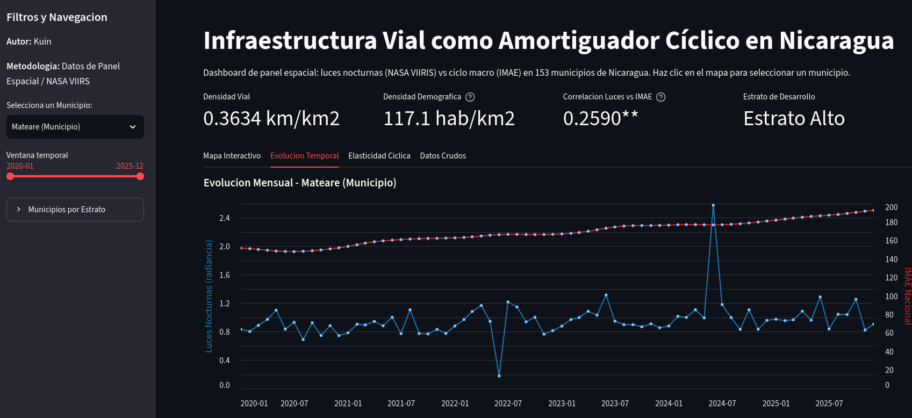

  

  
  &nbsp;&nbsp;&nbsp;&nbsp;&nbsp;&nbsp;&nbsp;&nbsp;
  

---

### Featured Research

* [**Remittances, Real Exchange Rate and Dutch Disease**](https://github.com/Emerson-nic/Bvar-Bvecm-Enfermedad_holandesa)  
  Applied BVECM/BVAR framework | Published / In Press in *Nexo Revista Científica*.

* [**Road Infrastructure and VIIRS Satellite Data**](https://github.com/Emerson-nic/road-infrastructure-nicaragua-viirs)  
  Preprint available on Zenodo.

* [**Effect of climate on dengue in Nicaragua**](https://github.com/Emerson-nic/Dengue-Nicaragua-Model)  
  Impact of climatic variables on dengue (in active development).

---

  
<strong>Versión en Español (Clic para desplegar / ocultar)</strong>

  
  <h4>Investigaciones Destacadas</h4>
  <ul>
    <li>
      <a href="https://github.com/Emerson-nic/Bvar-Bvecm-Enfermedad_holandesa"><strong>Remesas, Tipo de Cambio Real y Enfermedad Holandesa</strong></a> 
      Enfoque aplicado BVECM/BVAR | Publicado / En prensa en <em>Nexo Revista Científica</em>.
    </li>
    <li>
      <a href="https://github.com/Emerson-nic/road-infrastructure-nicaragua-viirs"><strong>Infraestructura Vial y Datos Satelitales VIIRS</strong></a> 
      Preprint disponible en Zenodo (en revisión).
    </li>
    <li>
      <a href="https://github.com/Emerson-nic/Dengue-Nicaragua-Model"><strong>Efecto del clima en el dengue en Nicaragua</strong></a> 
      Impacto de las variables climáticas en el dengue (en desarrollo activo).
    </li>
  </ul>

---

### Interactive Dashboard

  

  

---

### Academic & Profiles

  
  &nbsp;
  
  &nbsp;
  
  &nbsp;
  
  &nbsp;
  

